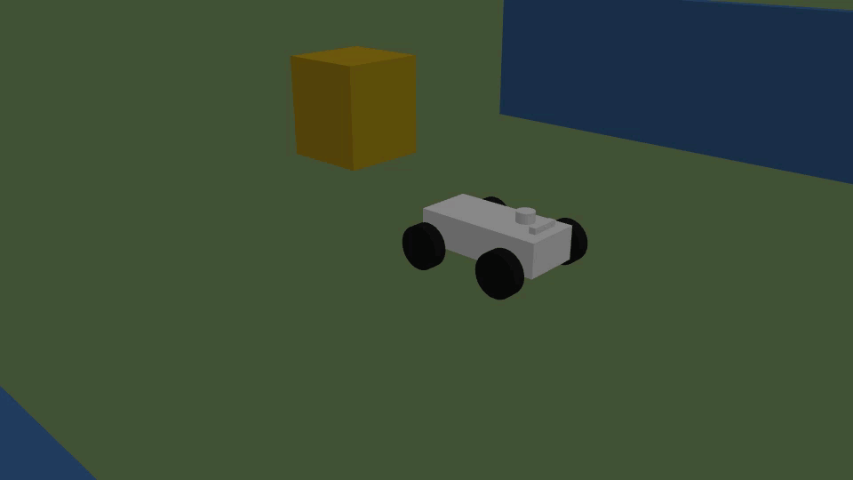
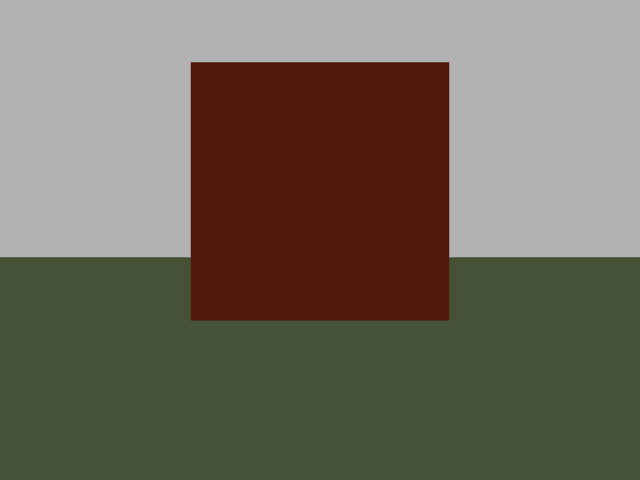

# LASTIMI · ROSbot Simulation

A ROS 2 simulation workspace for **LASTIMI** research on mobile robot control,
perception and terrain interaction. The platform combines **rear-wheel drive,
front Ackermann steering, independent suspension, a planar LiDAR and an RGB-D
camera** in Gazebo Classic.

The model is inspired by the [Roboworks ROSbot](https://www.roboworks.net/store/p/rosbot-pro-4wdis).
Its rear-drive configuration follows the laboratory's description of its robot.
It is a simplified research model, not the manufacturer's CAD model or a
validated digital twin. The product catalogue describes the Plus as 4WD;
that configuration is not implemented here.

**Platform:** Ubuntu 22.04 · ROS 2 Humble · Gazebo Classic 11 · Python 3.10

> Gazebo Classic reached end of life in January 2025. This package targets the
> existing Humble laboratory environment; modern Gazebo requires a port of the
> plugins and launch files. See the [Gazebo migration guide](https://gazebosim.org/docs/latest/gazebo_classic_migration/).

## Demonstration



A short recording rendered by Gazebo: idle, forward motion, a left turn,
reverse and stop. [Full-colour WebM video](docs/media/gazebo-demo.webm).
The 9.8-second clip condenses a 14-second simulated sequence.
This is a functional demonstration of the simplified model; see the
[validation report](docs/validation.md) for physical-model limitations.

<details>
<summary>View from the simulated RGB camera</summary>



640 × 480 image received from `/camera/image_raw` in the obstacle scene.

</details>

## Start here

1. Install dependencies and build the package.
2. Launch the obstacle demo with Gazebo and RViz.
3. Drive through `/cmd_vel` with the standard ROS keyboard teleoperation node.
4. Record ROS topics and report the exact simulation configuration with results.

See [ROS interfaces](docs/interfaces.md), [experiment and media guide](docs/experiments.md)
and [validation status](docs/validation.md) for details.

## Installation

Install ROS 2 Humble using the [official Ubuntu instructions](https://docs.ros.org/en/humble/Installation/Ubuntu-Install-Debs.html)
first. Place this package at `~/dev_ws/src/rosbot_plus_description`.
The commands below assume Bash and that workspace location.

```bash
sudo apt update
sudo apt install python3-colcon-common-extensions python3-rosdep \
  ros-humble-xacro ros-humble-gazebo-ros-pkgs \
  ros-humble-gazebo-ros2-control ros-humble-ros2-controllers \
  ros-humble-ackermann-steering-controller \
  ros-humble-teleop-twist-keyboard ros-humble-rviz2
```

Initialize rosdep once on a new machine (`sudo rosdep init`), then resolve all
package dependencies, including those of the retained legacy perception tools:

```bash
source /opt/ros/humble/setup.bash
cd ~/dev_ws
rosdep update
rosdep install --from-paths src/rosbot_plus_description --ignore-src -r -y
colcon build --packages-select rosbot_plus_description --symlink-install
source install/setup.bash
```

Source `/opt/ros/humble/setup.bash` and `~/dev_ws/install/setup.bash` in every
new simulation terminal. Repeat the build and restart Gazebo after editing
launch files, controller settings, URDF or world files.

## Launch the simulation

Flat ground is the baseline for checking the robot at rest:

```bash
ros2 launch rosbot_plus_description sim.launch.py gui:=true rviz:=true
```

The obstacle demo provides objects for the laser and camera to observe. It uses
local geometry and does not require downloading Gazebo models:

```bash
ros2 launch rosbot_plus_description sim.launch.py \
  gui:=true rviz:=true \
  world:="$(ros2 pkg prefix --share rosbot_plus_description)/world/demo_obstacles.sdf"
```

For a run without Gazebo or RViz windows:

```bash
ros2 launch rosbot_plus_description sim.launch.py gui:=false rviz:=false
```

The RGB-D camera still requires a working rendering environment. On a machine
without one, add `enable_camera:=false`. Use `display.launch.py` only for a
standalone URDF preview; it starts its own joint-state publisher and must not
be launched alongside the simulation.

## Drive the robot

In a second sourced terminal:

```bash
ros2 run teleop_twist_keyboard teleop_twist_keyboard
```

Both the keyboard and joystick publish `geometry_msgs/msg/Twist` on **`/cmd_vel`**.
The controller uses `linear.x` in m/s and `angular.z` in rad/s of body yaw rate;
`angular.z` is not a steering angle. The front wheels steer while the rear
wheels propel the robot. There is no turn-in-place mode.

For initial trials, use a gentle speed and yaw rate:

```bash
ros2 run teleop_twist_keyboard teleop_twist_keyboard \
  --ros-args -p speed:=0.2 -p turn:=0.1
```

Keep focus in the keyboard terminal: `i` moves forward, `,` moves backward,
`u`/`o` request forward turns, and `k` stops. A command expires after 0.5 seconds
without a new message. Depending on the teleoperation version, holding a key
uses the operating system's key repeat; joystick input is convenient for
continuous driving:

```bash
ros2 launch rosbot_plus_description joystick.launch.py
```

Run one command source at a time. Steering travel is limited to ±0.6 rad in the
model. Keep requested curvature within that travel; this package does not
provide a navigation command limiter or a path planner.

## ROS interfaces

| Topic | ROS type | Purpose |
| --- | --- | --- |
| `/cmd_vel` | `geometry_msgs/msg/Twist` | Velocity command input |
| `/odom` | `nav_msgs/msg/Odometry` | Wheel/steering odometry |
| `/mobile_base/sensors/imu_data` | `sensor_msgs/msg/Imu` | Simulated IMU |
| `/joint_states` | `sensor_msgs/msg/JointState` | Drive, steering and passive joints |
| `/scan` | `sensor_msgs/msg/LaserScan` | 360° planar laser |
| `/camera/image_raw` | `sensor_msgs/msg/Image` | RGB image |
| `/camera/depth/image_raw` | `sensor_msgs/msg/Image` | Depth image |
| `/camera/camera_info` | `sensor_msgs/msg/CameraInfo` | RGB camera calibration |
| `/camera/depth/camera_info` | `sensor_msgs/msg/CameraInfo` | Depth camera calibration |
| `/camera/points` | `sensor_msgs/msg/PointCloud2` | Camera depth cloud |
| `/ground_truth/odom` | `nav_msgs/msg/Odometry` | Gazebo reference pose for evaluation |
| `/clock` | `rosgraph_msgs/msg/Clock` | Simulation time |

ROS also supplies `/robot_description`, `/tf`, `/tf_static`, `/rosout` and
`/parameter_events`. Set `use_sim_time:=true` on analysis and visualization nodes.
Ground truth is reserved for evaluation and is not used by the controller.

The common command, odometry and IMU topic names follow the Wheeltec bring-up
reported by the laboratory. Battery, fused localization and vendor-specific
interfaces are not simulated. Their names and unresolved message types are
listed in the [hardware comparison](docs/interfaces.md#wheeltec-hardware-comparison).
Camera and LiDAR remain available even though they were absent from that
hardware topic listing.

## Model and sensors

| Element | Current representation |
| --- | --- |
| Propulsion | Two driven rear wheels; passive front wheel rotation |
| Direction | Two front steering joints, Ackermann kinematics |
| Suspension | Four passive vertical spring/damper joints |
| Nominal mass | 35.16 kg without optional payload |
| Wheel radius / track / wheelbase | 0.127 m / 0.59 m / 0.53 m |
| LiDAR | 400 samples, 12 Hz, 0.1–30 m, horizontal 360° scan |
| RGB-D camera | Generic 640 × 480 model, 15 Hz, 0.1–10 m clipping range |
| IMU | 200 Hz by default |
| W0 and demo physics | ODE, 0.2 ms time step, 100 solver iterations |

The wheelbase, inertias, suspension, contact parameters and sensor mounts
include estimates. The camera approximates an Orbbec housing; its optical
parameters are not a device calibration. The LiDAR is placed forward on the
chassis, behind the camera. Its historical frame name, `livox_frame`, is
retained for compatibility: **the current sensor is a 2D laser, not a Livox
Mid-360 simulation**.

A depth-camera point cloud does not make the old FAST-LIO pipeline compatible.
`fastlio_sim.launch.py`, `perception.launch.py` and the elevation mapping tools
are retained from an earlier 3D LiDAR setup and are outside the supported
planar-laser workflow.

## Useful launch arguments

| Argument | Default | Meaning |
| --- | --- | --- |
| `gui`, `rviz` | `false`, `false` | Open Gazebo client / RViz |
| `world` | `world/w0_flat.sdf` | Absolute path to a Gazebo Classic world |
| `enable_lidar`, `enable_camera` | `true`, `true` | Enable simulated sensing |
| `spawn_x`, `spawn_y`, `spawn_z`, `spawn_yaw` | `0`, `0`, `0.3`, `0` | Initial pose in metres / radians |
| `payload_mass` | `0.0` | Added mass in kg |
| `payload_x`, `payload_z` | `0.265`, `0.469` | Payload position in `base_link`, metres |
| `lidar_x_offset_m`, `lidar_riser_m` | `0.20`, `0.025` | Mount offset and extra height, metres |
| `lidar_tilt_deg` | `0` | Keep zero for the planar scan workflow |
| `imu_update_rate` | `200` | IMU frequency in Hz |

List all arguments with `ros2 launch rosbot_plus_description sim.launch.py --show-args`.

## Verify a run

```bash
ros2 control list_controllers
ros2 topic info /cmd_vel --verbose
ros2 topic echo /odom --once
ros2 topic echo /mobile_base/sensors/imu_data --once --qos-reliability best_effort
ros2 topic echo /scan --once --qos-reliability best_effort
```

`joint_broad` and `steering_cont` should both be `active`. Observe the robot at
rest before sending a command. See [validation status](docs/validation.md) for
what has actually been checked and what remains to be measured.

Run the model tests independently of the legacy 3D perception dependencies:

```bash
cd ~/dev_ws
source install/setup.bash
python3 -m pytest src/rosbot_plus_description/test/test_robot_description.py -q
```

## Troubleshooting

| Symptom | Check |
| --- | --- |
| `No module named xacro` | Install `ros-humble-xacro`, then source Humble and the workspace. |
| Model ignores recent edits | Rebuild, restart Gazebo, and check `ros2 pkg prefix --share rosbot_plus_description`. |
| Robot drifts or jumps without input | Stop command publishers; record `/cmd_vel`, `/joint_states`, `/odom` and ground truth. Report the world, payload and physics settings. |
| Laser shows only `inf` on W0 | The horizontal beam sees no obstacle on an empty plane. Use the obstacle demo. |
| RViz has no transform or wrong time | Use `rviz:=true`; check `/clock`, `/tf` and active controllers. Do not run `display.launch.py` simultaneously. |
| Camera fails without a desktop | Provide a rendering context or disable it with `enable_camera:=false`. |
| Controllers keep waiting | Inspect the first Gazebo/controller error, before the timeout messages. |
| Legacy tests cannot import `grid_map_msgs` | Install all declared dependencies with rosdep; these tests belong to the legacy perception tools. |

## Research use and contributions

Include the software revision, launch arguments, world, controller parameters
and recorded topics with each experiment. Do not interpret numerical stability
as validation of real suspension or terrain performance. Follow the
[experiment guide](docs/experiments.md) when preparing datasets, screenshots or
a short demonstration video.

Contributions are welcome in model calibration, reproducible benchmarks,
controller validation and migration to supported Gazebo versions. See
[CONTRIBUTING.md](CONTRIBUTING.md). The package metadata currently says `BSD`,
but this checkout has no license text or copyright-holder statement; these
must be clarified before an open-source release.
